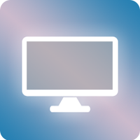
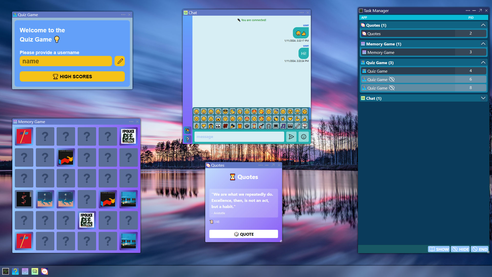

# Personal Web Desktop
This is a Personal Web Desktop (PWD) that is built with HTML5, CSS3/Tailwind, JS (Web Components, no frameworks) and Vite.

I tried my best to adhere to the separation of concerns principle and structure my code with an outlook of future development.

[Link to PWD Application](https://edweo.github.io/personal-web-desktop/)

### Features
- **Open Multiple Applications**
- **Closing Applications Perform Clean-up (websockets, etc.)**
- **Drag & Resize Application Windows**
- **Fullscreen Appplications**

### Apps
- User Applications (can be closed)
  - **Memory Game** (match cards to remove them until all cards are matched)
  - **Quiz Game** (test your knowledge of JavaScript)
  - **Quoutes App** (get encouriging quotes)
  - **Chat App** (chat using websockets with other clients running the app)
- System Applications (starts on start-up and runs in the background even when closed)
  - **Task Manager** (manage currently open applications: hide, close)

### Starting Application via NPM
1. Open terminal instance inside the project folder
2. Run `npm run i`
3. Run `npm run build`
4. Run `npm run serve`
5. Open `http://localhost:4444/` in your web browser

### Personal Web Desktop Example
More information and implementation details about the Personal Web Desktop can be found 
[here](/src/js/components/personal_web_desktop/README.md)

